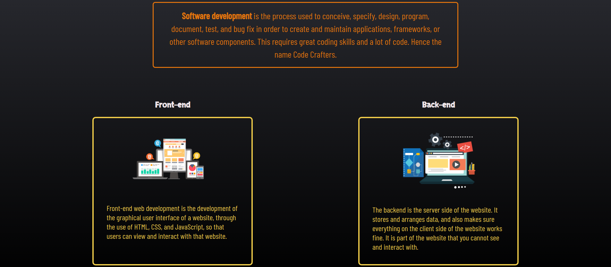
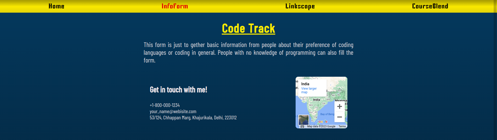
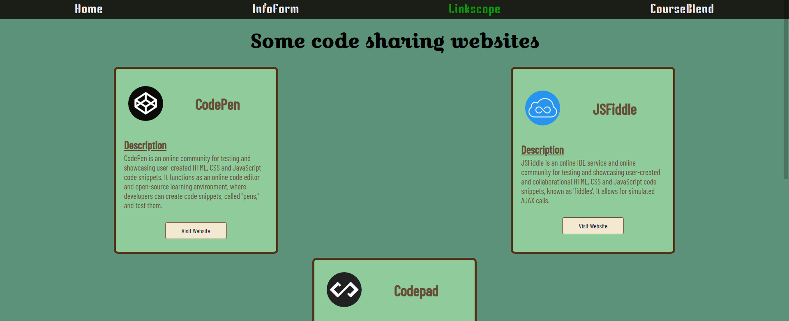
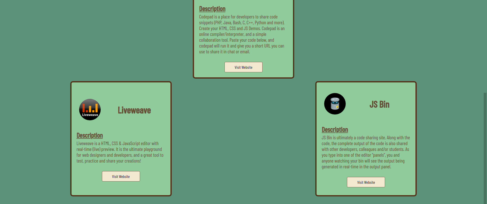
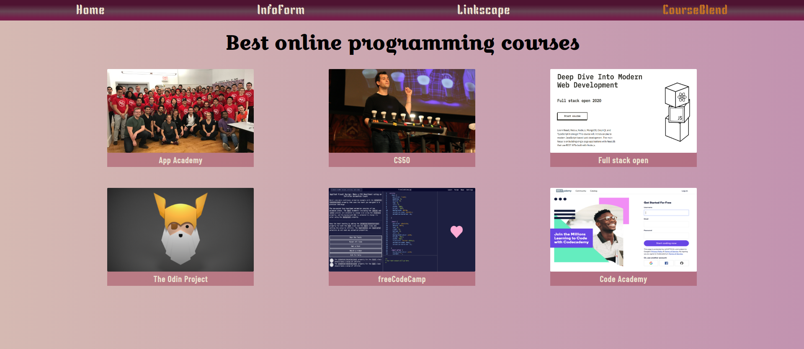

# Capstone Project - Code Crafters

### Description

This is my project "Code Crafters" which is built as an assignment created in 1 day for App Academy's "Building your first website" module. In the assignment we have to build a website on a topic of our own choice where we needed to fulfill the given criteria and requirements for a webpage and apply css to make the website look decent. I tried to find and use no-copyright images for the project, but I may have accidentally used copyrighted images since I picked some of them from google images. I also tried to make the website responsive keeping the required criteria in mind.

[Visit Website](https://capstone-codecrafters.netlify.app/)

#### The criteria:
- Page 1
    - Navigation Bar linking to all 4 pages
    - 1 header using H1
    - 3 sections of text with H2 headers
    - 1 image

- Page 2
    - Navigation Bar linking to all 4 pages

    HTML form with a minimum of:
    - 1 fieldset
    - 3 inputs
    - 2 text
    - 1 checkbox
    - 1 textarea

    Appropriate labels for the above
    - 1 button

- Page 3
    - Navigation Bar linking to all 4 pages
    - 1 header using H1
    - 1 ordered or unordered list of links to 5 other websites

- Page 4
    - Navigation Bar linking to all 4 pages
    - 1 header using H1
    - 6 images displayed 3 wide and 2 down
    - A label for each image
    - Clicking on the image opens the source of that image in a new window

- Each page must be appropriately and pleasantly styled using CSS.

---

## Screenshots

### Page 1

---

### Page 2

---

### Page 3

---

### Page 4

